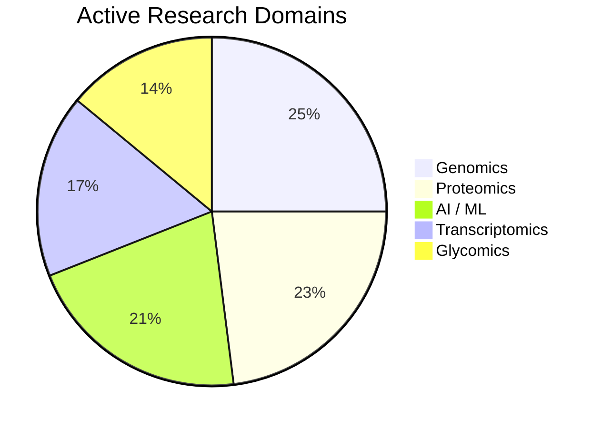

# ZEYNEP AKDENIZ · PhD

**Senior Bioinformatician · Pharma & Drug Discovery**

AI / ML &nbsp;·&nbsp; Multi-Omics &nbsp;·&nbsp; NGS &nbsp;·&nbsp; Pipeline Engineering &nbsp;·&nbsp; HPC · Reproducible Research

 

&nbsp;

&nbsp;

---

9 years building reproducible pipelines across Multi-Omics, NGS, and AI/ML. From HPC clusters to one-line Snakemake deploys: 4 production pipelines, 3 Nature-family papers, 3 de novo genomes assembled. Reproducible research is the difference between a result and knowledge.

---

## Publications

| Date | Journal | Title | Authors |
|---|---|---|---|
| Dec 2025 | **Nature Communications** | GlyContact analyzes glycan 3D structures at scale | Thomès · Joeres · Akdeniz · Bojar |
| Aug 2024 | **Scientific Data** | Expanded genome of *Hexamita inflata*, a free-living diplomonad | Akdeniz et al. |
| Sep 2022 | **Scientific Data** | Chromosome-scale reference genome — *Spironucleus salmonicida* | Xu · Jiménez-González · Akdeniz et al. |

---

## Projects

### [GenoDiplo](https://github.com/zeyak/GenoDiplo)

Snakemake pipeline for de novo genome assembly and annotation of diplomonad eukaryotes. Applied to *Spironucleus barkhanus*; underpins the *Hexamita inflata* Scientific Data 2024 paper. Covers raw read QC through structural and functional annotation to comparative genomics.

| Stage | Tools |
|---|---|
| Quality Control | FastQC · MultiQC · Trimmomatic |
| Assembly | Flye (Nanopore long reads) |
| Evaluation | QUAST · Meryl · Winnowmap · DeepTools |
| Structural Annotation | Prodigal · GlimmerHMM |
| Functional Annotation | DIAMOND BLASTp · eggNOG-mapper · InterProScan |
| Repeat & ncRNA | RepeatModeler · RepeatMasker · tRNAscan-SE · Barrnap |
| Comparative Genomics | CD-HIT · OrthoFinder |

---

### [CompareDiplo](https://github.com/zeyak/CompareDiplo)

Comparative genomics pipeline extending GenoDiplo across diplomonad species (free-living vs. parasitic). Clusters protein families by OrthoFinder, maps InterPro/PFAM/KEGG domains, and traces evolutionary trajectories. Revealed protein family expansions correlated with lifestyle adaptation in anaerobic environments.

---

### [Deep-Bio](https://github.com/zeyak/Deep-Bio)

M.Sc. thesis (Kadir Has University, 2016–2018). Applies Softmax Regression, FFNN, and LSTM to four biological and clinical datasets, benchmarking model complexity against classification accuracy.

| Dataset | Task | Softmax | FFNN |
|---|---|---|---|
| Anuran Call (15 frog species) | Multiclass classification | 78% | **95%** |
| Thyroid Patients (72k records) | Diagnostic classification | baseline | — |
| E. coli Protein Localization | Subcellular site prediction (8 classes) | baseline | — |
| HIV Cleavage Sites (6,590 sequences) | Binary classification | 81% | improved with LSTM |

---

### [Bioinformatics-Bootcamp](https://github.com/zeyak/Bioinformatics-Bootcamp)

Teaching materials from the Miuul Data Science Bioinformatics Bootcamp (2023–2025), 2 cohorts, 50+ graduates.

| Module | Topics |
|---|---|
| Foundations | Python · Linux · Git · Anaconda |
| Workflow Management | Snakemake — tRNA scanning, wildcards |
| Sequencing & Assembly | Nanopore · Illumina · PacBio · FASTA/GFF formats |
| Annotation | BLAST · InterProScan · IPR domains |
| Comparative Genomics | OrthoFinder · orthologs/paralogs · heatmaps · UpSet plots |
| Transposable Elements | RepeatMasker · stained glass visualisation |

---

### Between Data & Dreams *(in development)*

An education platform in engineering and life sciences — currently in active development. Covers bioinformatics, AI/ML, and data science for students across Turkey, Sweden, and Japan. 1,000+ students reached through bootcamps, webinars (300+ attendees), and outreach at the Stockholm Natural History Museum and Vetenskapsfestivalen, Gothenburg.

---

## Pipeline Engineering

The core of my work over 9 years has been designing, building, and maintaining production-grade bioinformatics pipelines — from raw sequencing data to publishable results. Snakemake is my primary orchestration framework; every pipeline I ship is modular, conda-managed, HPC-ready, and version-controlled.

| Capability | Detail |
|---|---|
| Orchestration | Snakemake (90%) — rule graphs, wildcards, checkpoints, cluster profiles |
| Environment Management | Conda / Docker per-rule environments (88%) |
| HPC / SLURM | Job scheduling, resource allocation, parallel execution (85%) |
| Version Control | Git — structured commit history, reproducible deploys (92%) |
| Languages | Python (95%) · Bash / Linux (88%) · R (35%) |
| AI / ML Stack | TensorFlow · Keras · scikit-learn · GPU inference (82%) |
| Cloud / DevOps | Early-stage (40%) — actively expanding |

---

## Omics Exposure

---

## What I Am Curious About Next

The field is moving fast. These are the areas I am actively following, reading, and looking to contribute to next.

| Area | Why it matters |
|---|---|
| Spatial transcriptomics | Adding tissue-level coordinates to gene expression — bridging omics and morphology |
| Single-cell multi-omics | scRNA-seq, scATAC-seq, CITE-seq — resolving cell-type heterogeneity at scale |
| Multimodal AI integration | Combining genomics, proteomics, and clinical layers in unified ML models |
| Biological foundation models | DNA/protein language models (ESM, Evo, Nucleotide Transformer) for zero-shot prediction |
| Graph neural networks on omics | Protein interaction networks, metabolic graphs — structure-aware learning |
| Long-read single-cell | Nanopore/PacBio scRNA — isoform-resolved, direct RNA at single-cell resolution |
| Drug target discovery pipelines | Multi-omics integration for target ID and biomarker stratification in pharma |

---

## GitHub Stats

&nbsp;

Public activity reflects open teaching and research repos. Production pipelines run on institutional HPC clusters and private repositories. Current low-commit periods correspond to full-time development of Between Data & Dreams and prior teaching-intensive roles.

---

Gothenburg, Sweden · ORCID available on request · Last updated April 2026

