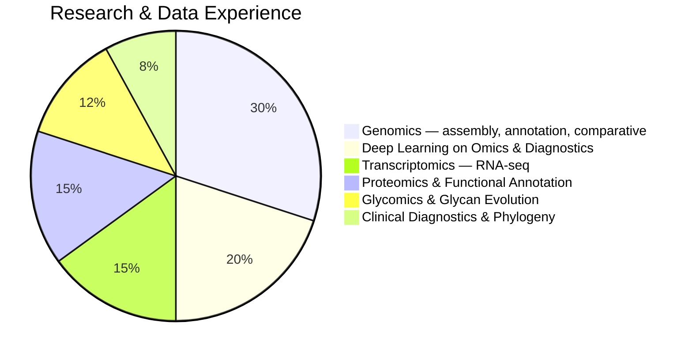
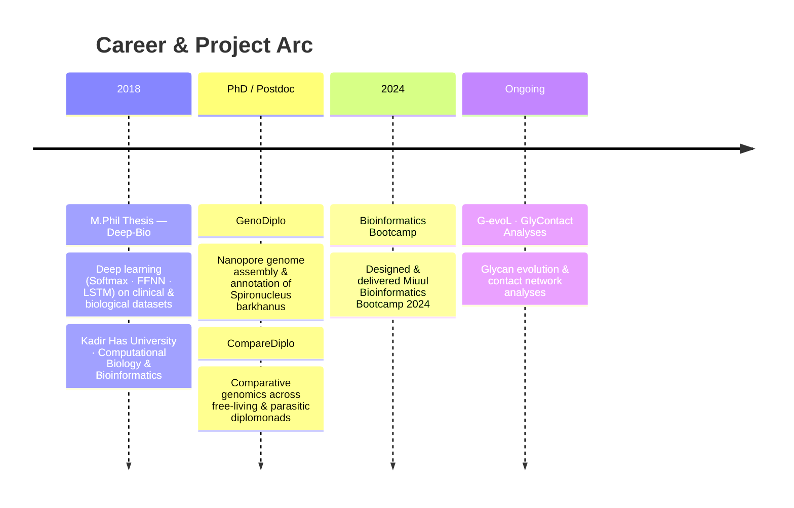

# Hi, I'm Zeynep 👋

### Computational Biologist · Postdoctoral Researcher

*From deep learning on clinical data to diplomonad genomes —  
building reproducible, multi-omics pipelines across the tree of life*

---

## About Me

I am a postdoctoral researcher in computational biology, with a background spanning deep learning applications on clinical and omics data (M.Phil., Kadir Has University), eukaryotic genome assembly and annotation, comparative diplomonad genomics, and glycomics. I design end-to-end bioinformatics pipelines — from raw Nanopore/Illumina/PacBio reads to genome-scale biological interpretation — and I teach these methods through structured bootcamps.

---

## Research Landscape

---

## Research Timeline

---

## Featured Projects

### 🧠 [Deep-Bio](https://github.com/zeyak/Deep-Bio)
> **M.Phil Thesis** · Deep Learning Applications on Omics Data and Diagnostics · Kadir Has University, 2018

Applied Softmax Regression, Feed Forward Neural Networks (FFNN), and LSTM to four biological and clinical datasets, demonstrating systematic accuracy gains as model complexity increases.

**Datasets & Results**

| Dataset | Task | Classes | Softmax | FFNN |
|---|---|---|---|---|
| Anuran Call (frog species) | Multiclass classification | 15 | 78% | **95%** |
| Thyroid Patients | Diagnosis classification | 3 | ✓ | — |
| E. coli Protein Localization | Subcellular site prediction | 8 | ✓ | — |
| HIV Cleavage Sites | Binary classification | 2 | 81% | **improved with LSTM** |

**Key notebooks:** Softmax → Keras + optimizer comparison (ADAM/SGD/RMSprop) → bias-variance tradeoff → FFNN regularization (L2, Dropout) → LSTM

`Python` `TensorFlow` `Keras` `Scikit-learn` `FFNN` `LSTM` `Clinical Data` `Omics`

---

### 🧬 [GenoDiplo](https://github.com/zeyak/GenoDiplo)
> Reproducible Snakemake pipeline for diplomonad genome assembly & annotation

End-to-end workflow for eukaryotic microbial genomes, applied to *Spironucleus barkhanus*. Covers raw read QC through structural and functional annotation to comparative genomics.

**Pipeline stages**

| Stage | Tools |
|---|---|
| Quality Control | FastQC · MultiQC · Trimmomatic |
| Assembly | Flye (Nanopore long reads) |
| Assembly Evaluation | QUAST · Meryl · Winnowmap · DeepTools |
| Structural Annotation | Prodigal · GlimmerHMM |
| Functional Annotation | DIAMOND BLASTp · eggNOG-mapper · InterProScan |
| Repeat & ncRNA | RepeatModeler · RepeatMasker · tRNAscan-SE · Barrnap |
| Comparative Genomics | CD-HIT · OrthoFinder |

`Snakemake` `Python` `Nanopore` `Conda` `Genome Assembly` `Functional Annotation`

---

### 🔬 [CompareDiplo](https://github.com/zeyak/CompareDiplo)
> Comparative genomics pipeline for free-living vs. parasitic diplomonads

Extends GenoDiplo into multi-species comparative analysis. Clusters protein families, maps InterPro/PFAM/KEGG domains, and uses OrthoFinder to trace evolutionary trajectories across diplomonad lineages.

**What it revealed:**
- Expanded protein families correlated with lifestyle adaptations in anaerobic environments
- New insights into protein family complexity in *H. inflata*
- Evolutionary divergence patterns between free-living and parasitic species

**Core tools:** OrthoFinder · InterProScan · eggNOG-mapper · PFAM/Superfamily domain analysis

`Python` `Snakemake` `Comparative Genomics` `OrthoFinder` `InterProScan` `Diplomonads`

---

### 📚 [Bioinformatics-Bootcamp](https://github.com/zeyak/Bioinformatics-Bootcamp)
> Miuul Bioinformatics Bootcamp 2024 — teaching materials & practicals

Designed and delivered a structured bootcamp covering the full bioinformatics stack. Topics span tool setup, programming, workflow management, and multi-omics analysis.

**Curriculum**

| Module | Topics |
|---|---|
| Foundations | Python · Linux · GitHub · Anaconda setup |
| Workflow Management | Snakemake (tRNA scanning rules, wildcards) |
| Databases | NCBI Genome · IPR Domains |
| Sequencing & Assembly | PacBio · Illumina · Nanopore · FASTA/GFF/contig formats |
| Annotation | BLAST (advanced) · InterProScan · superfamilies · domains |
| Comparative Genomics | OrthoFinder · orthologs/paralogs · heatmaps · UpSet plots |
| Metabolic Analysis | iPath pathway visualisation |
| Transposable Elements | RepeatMasker · stained glass visualisation |
| Data Visualisation | Scatter plots · heatmaps · UpSet plots |

`Python` `Snakemake` `NGS` `BLAST` `Comparative Genomics` `Teaching`

---

### 🍬 [G-evoL](https://github.com/zeyak/G-evoL) · [GlyContact Analyses](https://github.com/zeyak/GlyContact_analyses)
> Glycan evolution & glycan–protein contact network analyses *(in progress)*

Ongoing glycomics work exploring glycan structural evolution and contact network patterns across species.

`Glycomics` `Python` `Network Analysis` `Glycan Evolution`

---

## Toolkit

**Languages & Workflow**

**Sequencing & Data Types**

| Platform | Data | Applications |
|---|---|---|
| Oxford Nanopore | Long reads | De novo assembly · direct RNA |
| Illumina | Short reads | RNA-seq · WGS · polishing |
| PacBio | HiFi long reads | High-accuracy assembly · isoforms |
| Clinical records | Tabular / sequences | Diagnostic classification · variant analysis |
| Protein sequences | FASTA / UniProt | Functional annotation · DIAMOND BLASTp |
| Glycan structures | Contact networks | Glycan evolution · structural analysis |

---

## GitHub Stats

---

Last updated April 2026

