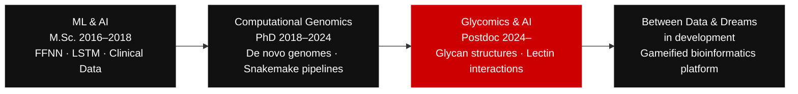
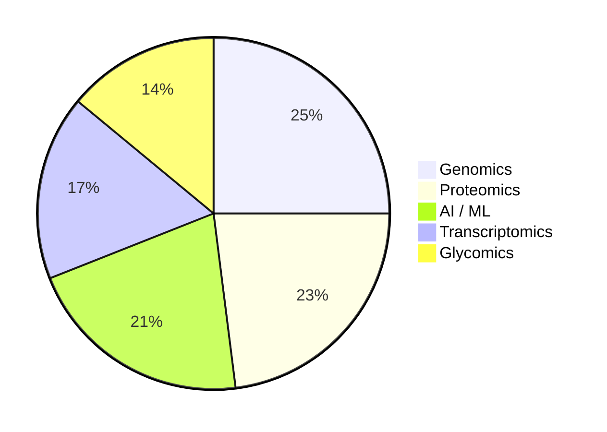

# ZEYNEP AKDENIZ · PhD

**Senior Bioinformatician · Pipeline Engineer · Pharma & Drug Discovery**

*Started with neural networks. Moved into genomes.*
*Now building the platform where both worlds collide.*

&nbsp;

&nbsp;

---

## The Arc

---

## Skills

**Pipeline Engineering & Infrastructure**

**AI / ML**

**Bioinformatics Stack**

---

## Omics Exposure

---

## Currently Building

&nbsp;

> *where humans and robots learn togethER*

A mission-based learning platform for bioinformatics and life science data, set in a post-apocalyptic Mars universe. Students don't take courses — they run missions. The science is real. The world is not.

The central metaphor is *Hexamita inflata* — the free-living diplomonad at the centre of my PhD. Learning progresses through three mission moons:

| Moon | Track | State |
|---|---|---|
| PAST · Marsfield School | Foundational science for beginners | Hexamita as illustration |
| PRESENT · Digital Campus | Active online programs and cohorts | Hexamita dissected |
| FUTURE · Between Institute | Advanced research and independent work | Hexamita free-living |

The goal: *travel through 3 mission moons and become a free-living hexamita.*

1,000+ students reached across Turkey, Sweden, and Japan. Outreach at the Stockholm Natural History Museum and Vetenskapsfestivalen, Gothenburg. Repository private — launching soon.

---

## Projects

**[GenoDiplo](https://github.com/zeyak/GenoDiplo)** &nbsp; 
End-to-end Snakemake pipeline: Nanopore assembly → structural & functional annotation → comparative genomics. Applied to *S. barkhanus*; underpins the first de novo genome of a free-living diplomonad.

**[CompareDiplo](https://github.com/zeyak/CompareDiplo)**
Multi-species comparative genomics across diplomonad lineages. OrthoFinder · InterProScan · PFAM domain clustering. Traces evolutionary divergence between free-living and parasitic species.

**[Deep-Bio](https://github.com/zeyak/Deep-Bio)** &nbsp; 
Deep learning on biological and clinical data: Softmax → FFNN → LSTM across four datasets (Anuran, Thyroid, E. coli, HIV). Accuracy gains from 78% → 95% with model complexity.

**[Bioinformatics-Bootcamp](https://github.com/zeyak/Bioinformatics-Bootcamp)** &nbsp; 
Teaching materials from Miuul Data Science Bootcamp 2023–2025. Python · Linux · Snakemake · NGS · comparative genomics · visualisation.

---

## What I Want to Work on Next

| Area | Interest |
|---|---|
| Spatial transcriptomics | Mapping gene expression to tissue coordinates |
| Single-cell multi-omics | scRNA-seq · scATAC-seq · CITE-seq at cell-type resolution |
| Biological foundation models | ESM · Evo · Nucleotide Transformer for zero-shot prediction |
| Multimodal AI integration | Merging omics layers with clinical data in unified models |
| Graph neural networks | Protein interaction and metabolic network learning |
| Drug target discovery | Multi-omics pipelines for target ID and biomarker stratification |

---

## Publications

Thomès · Joeres · **Akdeniz** · Bojar — *GlyContact analyzes glycan 3D structures at scale* — **Nature Communications**, Dec 2025

**Akdeniz** et al. — *Expanded genome of Hexamita inflata, a free-living diplomonad* — **Scientific Data**, Aug 2024

Xu · Jiménez-González · **Akdeniz** et al. — *Chromosome-scale reference genome — Spironucleus salmonicida* — **Scientific Data**, Sep 2022

---

## GitHub Stats

&nbsp;

Public activity reflects open teaching and research repos. Production pipelines run on institutional HPC and private repositories. Current low-commit periods correspond to full-time development of Between Data & Dreams and prior teaching-intensive roles.

---

Gothenburg, Sweden · Last updated April 2026

