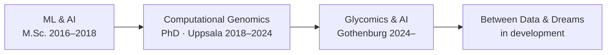

Started with neural networks. Moved into genomes. Now combining both — and building the platform where that intersection becomes teachable.

9 years across multi-omics, NGS, and AI/ML. 4 production pipelines. 3 Nature-family papers. 3 de novo genomes.

---

## Career Arc



---

## Skills

| Area | Stack |
|---|---|
| Pipeline Engineering | Snakemake · Python · Bash · Docker · Conda · HPC/SLURM · Git |
| AI / ML | TensorFlow · Keras · scikit-learn · FFNN · LSTM · GPU inference |
| Bioinformatics | Genome Assembly · Structural & Functional Annotation · Comparative Genomics · NGS |

---

## Omics Exposure

```
Genomics          ▓▓▓▓▓▓▓▓▓▓  6 yrs
Proteomics        ▓▓▓▓▓▓▓▓▓░  6 yrs
AI / ML           ▓▓▓▓▓▓▓▓░░  4 yrs
Transcriptomics   ▓▓▓▓▓▓▓░░░  6 yrs
Glycomics         ▓▓▓▓▓░░░░░  2 yrs
```

---

## Projects

**[GenoDiplo](https://github.com/zeyak/GenoDiplo)** &nbsp;·&nbsp; *Scientific Data 2024*

End-to-end Snakemake pipeline for diplomonad genome assembly and annotation. Applied to *S. barkhanus*, it underpins the first de novo genome of a free-living diplomonad (*H. inflata*). Covers Nanopore assembly through structural annotation, functional annotation, repeat masking, and comparative genomics.

**[CompareDiplo](https://github.com/zeyak/CompareDiplo)**

Multi-species comparative genomics across diplomonad lineages. Clusters protein families via OrthoFinder, maps InterPro/PFAM/KEGG domains, and traces evolutionary divergence between free-living and parasitic species.

**[Deep-Bio](https://github.com/zeyak/Deep-Bio)** &nbsp;·&nbsp; *M.Sc. Thesis, Kadir Has University 2018*

Deep learning on biological and clinical data. Applies Softmax, FFNN, and LSTM across four datasets — frog species acoustics, thyroid diagnosis, E. coli protein localization, HIV cleavage sites. Accuracy improves from 78% to 95% with model complexity.

**[Bioinformatics-Bootcamp](https://github.com/zeyak/Bioinformatics-Bootcamp)** &nbsp;·&nbsp; *Miuul 2023–2025, 50+ graduates*

Teaching materials from two cohorts of the Miuul Bioinformatics Bootcamp. Python, Linux, Snakemake, NGS, comparative genomics, functional annotation, and visualisation.

---

## Currently Building

**Between Data & Dreams** &nbsp;·&nbsp; [betweendataanddreams.com](https://betweendataanddreams.com) &nbsp;·&nbsp; *private repo, in development*

A gamified learning platform for bioinformatics and life science data. Students progress through three tracks — foundational science, active online programs, and independent research — mirroring the evolutionary stages of *Hexamita inflata*, the free-living diplomonad at the centre of my PhD. The science is real. The world around it is not.

1,000+ students reached across Turkey, Sweden, and Japan through bootcamps, webinars, and outreach at the Stockholm Natural History Museum and Vetenskapsfestivalen Gothenburg.

---

## What I Want to Work on Next

| Area | Why |
|---|---|
| Spatial transcriptomics | Mapping gene expression to tissue coordinates |
| Single-cell multi-omics | scRNA-seq, scATAC-seq, CITE-seq at cell-type resolution |
| Biological foundation models | ESM, Evo, Nucleotide Transformer for sequence-level prediction |
| Multimodal AI integration | Merging omics layers with clinical data in unified models |
| Drug target discovery | Multi-omics pipelines for target ID and biomarker stratification |

---

## Publications

Thomès · Joeres · **Akdeniz** · Bojar &nbsp;·&nbsp; *GlyContact analyzes glycan 3D structures at scale* &nbsp;·&nbsp; **Nature Communications**, Dec 2025

**Akdeniz** et al. &nbsp;·&nbsp; *Expanded genome of Hexamita inflata, a free-living diplomonad* &nbsp;·&nbsp; **Scientific Data**, Aug 2024

Xu · Jiménez-González · **Akdeniz** et al. &nbsp;·&nbsp; *Chromosome-scale reference genome of Spironucleus salmonicida* &nbsp;·&nbsp; **Scientific Data**, Sep 2022

---

## GitHub Stats

<div align="center">


&nbsp;&nbsp;


</div>

<div align="center">
<sub>Public activity reflects open teaching and research repos. Production work runs on institutional HPC and private repositories.</sub>
</div>

---

<div align="center">
<sub>Gothenburg, Sweden &nbsp;·&nbsp; Last updated April 2026</sub>
</div>
